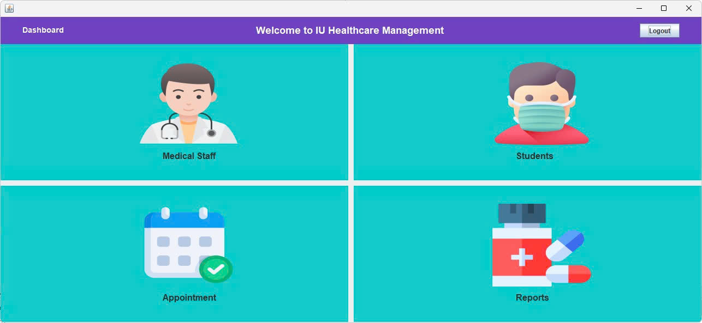
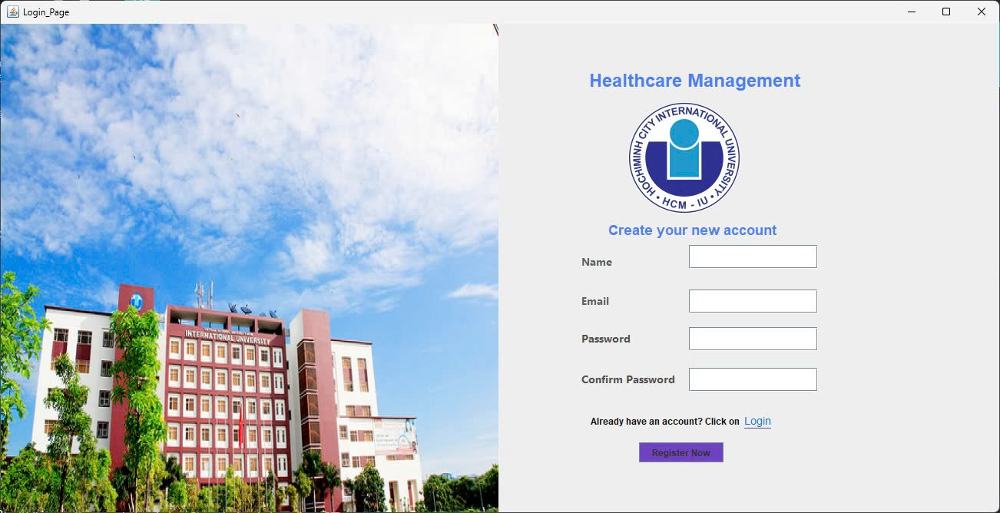

# University Healthcare Database (UHD)

> A clean project for Principles of Database Management course built with **Java Swing** and **MySQL** to demonstrate OOP design, maintainability, and a user-friendly desktop interface.

---



## Table of Contents

1. [About](#about)
2. [Features](#features)
3. [Technologies](#technologies)
4. [Project Gallery](#project-gallery)
5. [Prerequisites](#prerequisites)
6. [Setup & Run](#setup--run)
7. [Database](#database)
8. [Coding Philosophy & OOP Notes](#coding-philosophy--oop-notes)


---

## About

This **University Healthcare Database (UHD)** is a project developed for Principles of Database Management course. It demonstrates how OOP concepts (encapsulation, inheritance, polymorphism, and abstraction) are used to design a clean, modular, and maintainable desktop application. The UI is built with **Java Swing** and the persistent layer uses **MySQL**.

---

## Features

### Authentication & User Management

* Secure **Login** with input validation.
* **Registration** form with field-level validation and helpful form feedback.

### Dashboard

* Centralized, attractive dashboard for easy navigation.
* Four main modules accessible from the dashboard:

  1. **Medical Staff**
  2. **Appointment**
  3. **Students**
  4. **Reports**

### CRUD Operations

Each module supports the common CRUD operations:

* **Create** — Add new records.
* **Read** — Browse and search lists of records.
* **Update** — Edit existing entries using forms.
* **Delete** — Remove records safely (with confirmation prompts).

---

## Technologies

* **Java (Swing)** — Desktop UI
* **MySQL** — Relational database for persistent storage
* **OOP Principles** — Clean separation of concerns, modular classes, and reusable components

---

## Project Gallery

Display the GUI screenshots included with the repository:





---

## Prerequisites

Make sure you have the following installed on your development machine:

* Java JDK (11+ recommended)
* MySQL Server (or compatible MariaDB)
* An IDE such as IntelliJ IDEA, Eclipse, or NetBeans
* MySQL Workbench (or another client) for importing the database dump

---

## Setup & Run

Follow the steps below to run the application locally.

1. **Clone the repository**

```bash
# replace with your repo URL
git clone <repository-url>
cd university-healthcare-database
```

2. **Import the database**

* Open MySQL Workbench (or your preferred client) and import the provided SQL dump (if available) or run the schema SQL in the `database` folder.
* Create a database named, for example, `university_healthcare_database` (or the name used in the project config).

3. **Configure database connection**

* Locate the database connection/config file in the source (commonly under `src/config` or a `DBConnection.java`).
* Update the credentials (`host`, `port`, `database`, `username`, `password`) to match your MySQL setup.

4. **Build & Run**

* From your IDE: open the project and run the main application class (e.g. `com.yourpackage.Main` or `AppLauncher`).
* From the command line (if using a build tool):

```bash
# if using Gradle
./gradlew run

# if using Maven
mvn clean package
java -jar build/libs/your-app.jar
```

> Tip: If the project is plain Java without a build tool, compile and run from your IDE or use `javac` and `java` with appropriate classpaths.

---

## Database 

The application uses a relational schema with tables for Users, Doctors, Patients, Appointments, and Medicines. The database includes basic constraints and relationships to ensure referential integrity.

> If you want, you can include your SQL dump in `database/data.sql` and run it with:

```sql
SOURCE database/data.sql;
```
---

## Coding Philosophy & OOP Notes

* **Single Responsibility**: Each class has a clear, single responsibility (e.g., DAO classes only handle DB access).
* **Encapsulation**: Model fields are private with getters/setters; input validation is performed before persistence.
* **DRY & Reuse**: Shared UI components and utilities to avoid duplication.
* **Layered Design**: Presentation (Swing), service (business rules), and persistence layers are separated for clarity and testability.


