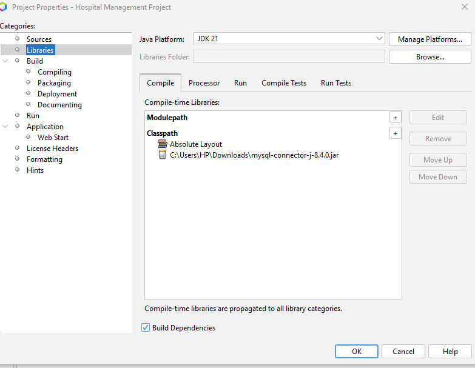

# **University Healthcare Database Project Setup Guide**

Welcome to the **University Healthcare Database project**! This guide will walk you through setting up and running the project.

---

## **Project Structure**
The project folder contains two main directories:
1. **`database/`**: Contains the database script for setting up the required tables and data.
2. **`pdm-project/`**: The main project folder to be opened in NetBeans.

---

## **Setting Up the Database**
1. Navigate to the `database` folder.
2. Run the `data.sql` file in your MySQL Workbench or a similar tool.
3. This script will:
   - Create the required tables.
   - Populate the database with some random sample data.

---

## **Opening the Project in NetBeans**
1. Open **NetBeans IDE**.
2. Select **File > Open Project** from the menu.
3. Navigate to the `University Healthcare Database` folder and open it.

---

## **Potential Issues and Solutions**

### **JDK 21 Issues**
If you encounter issues related to JDK 21, follow these steps:
1. Remove any broken or problematic JDK 21 setup.
2. Right-click on the project in NetBeans and select **Properties**.
3. Navigate to the **Libraries** section.
4. Set the Java platform to your preferred version (e.g., `JDK 21`).
5. Manage the compile-time libraries:
   - Add necessary database JAR files (e.g., MySQL Connector/J).
   - Remove any outdated or incompatible libraries.
6. Perform a **Clean and Build** operation for the project.

### **Project Path Issues**
Nested paths can sometimes cause issues while building the project. To resolve this:
1. Move the project folder to a top-level directory, such as `C:\` or `D:\`.

---

## **Running the Project**
1. After setting up the database and opening the project in NetBeans, locate the **`Main.java`** file in the `Main` package.
2. Right-click on the file and select **Run File**.

---

## **Additional Notes**
- Ensure that your MySQL service is running before executing the project.
- Keep the database configuration consistent with the project's database connection setup.

---
